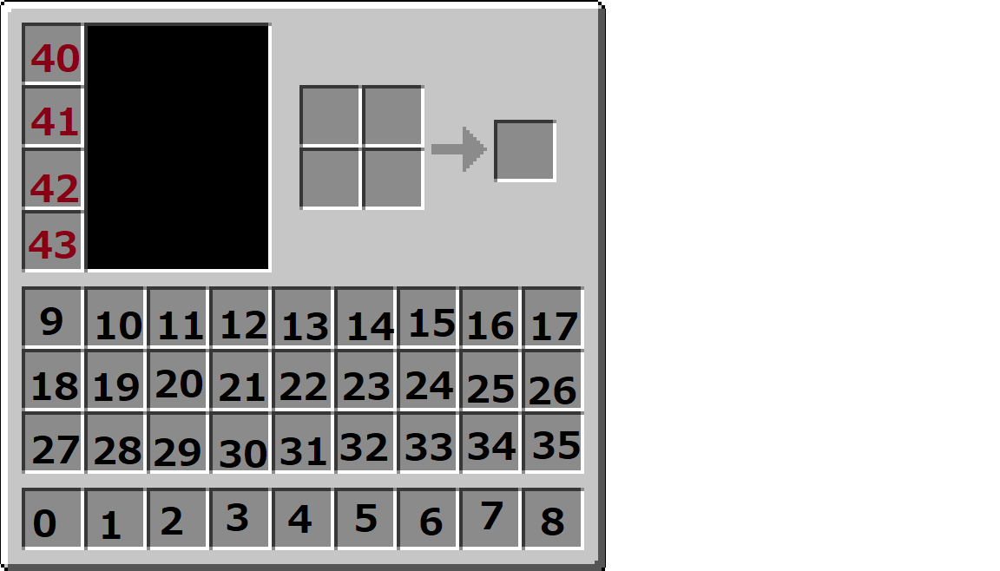

Writing YML
=============

How to write config.yml in the map folder.

.. toctree::
   :maxdepth: 1
   :caption: Contents:

* :ref:`base`
* :ref:`spawn`
* :ref:`region`
* :ref:`kit`

.. _base:

Basic config.yml

----------------------------

::

	name: 'Map Name'
	gametype: gamemode
	allow-build: true
	fall-damage: true
	
	// Write here the setting such as spawn, kits, and special settings of gametype.

===================== ====================================== ===================================== =============
Item(\* is required)  Description                            Value                                 Default
===================== ====================================== ===================================== =============
\*name                表示されるマップ名。                   String
\*gametype            The gametype.                          :doc:`../data/gametype`
allow-build           Allows breaking/placing blocks.        true/false                            true
fall-damage           Enables fall damage.                   true/false                            true
allow-damage          Enables any damage.                    true/false                            true
===================== ====================================== ===================================== =============

.. _team:

チームの設定
-----------------------

Team can be defined like this.

::

	teams:
	  red:
	    name: 'Red Team'
	    color: red
	    max: 16
	  blue:
	    name: 'Blue Team'
	    color: blue
	    max: 16

The value such as ``red`` and ``blue`` are Team ID used on settings such as spawns and kits. They don't have to be same as ``color`` value.

===================== ===================================================================== =========================================== =========================
Item(\* is required)  Description                                                           Value                                       Default
===================== ===================================================================== =========================================== =========================
\*name                The name of Team. If it is too long, it won't be displayed properly.  String
\*color               The color applied on Player Name and Team Name.                       :doc:`../data/chatcolor`
\*max                 Maximum players for this team.                                        Integer
===================== ===================================================================== =========================================== =========================

.. _spawn:

スポーン位置の設定
-----------------------

スポーン位置はこのように定義します。

::

	location:
	  red:
	    x: 0.0
	    y: 14.5
	    z: 128.0
	    yaw: -180
	    pitch: 0
	  blue:
	    x: 0.0
	    y: 14.5
	    z: -127.0
	    yaw: 0
	    pitch: 0
	  spectator:
	    x: -51.5
	    y: 46
	    z: 0.5
	    yaw: -90
	    pitch: 0

``red`` や ``blue`` はチームの ID で、そのチームのスポーン位置です。

================= ======================================================= =========================================== =========================
項目(\*は必須)    説明                                                    値                                          デフォルト値
================= ======================================================= =========================================== =========================
\*spectator       サーバーへのログイン時に出る位置です。                  X, Y, Z
================= ======================================================= =========================================== =========================

.. _region:

Region の設定
---------------
Region を設定することで、相手チーム拠点への立ち入りや建築を制限したりすることができます。 Region はいくつでも設定することができます。

Region はこのように定義します。

::

	regions:
	  bluebase:
	    team: blue
	    name: 'Blue Base'
	    enter: false
	    pos1:
	      x: -15.5
	      y: 0
	      z: -135
	    pos2:
	      x: 15.5
	      y: 255
	      z: -118.5
	    deny-message: '敵のチームの拠点に入ることはできません'
	  redbase:
	    team: red
	    name: 'Red Base'
	    enter: false
	    pos1:
	      x: 15.5
	      y: 0
	      z: 135.5
	    pos2:
	      x: -15.5
	      y: 255
	      z: 118.5
	    deny-message: '敵のチームの拠点に入ることはできません'

``bluebase`` や ``redbase`` は内部で処理するための ID なので、 **半角英数字** であれば何でも設定できます。

================= ======================================================= ===================================== =========================
項目(\*は必須)    説明                                                    値                                    デフォルト値
================= ======================================================= ===================================== =========================
\*team            enter の影響を受けないチームの ID 。                    チーム ID
\*name            Region の名前。将来的に使われる可能性があります。       文字列
enter             Region に入れるかどうか。                               true/false                            false
\*pos1            Region の範囲の地点1。                                  X, Y, Z
\*pos2            Region の範囲の地点2。                                  X, Y, Z
deny-message      Region に入れないチームが入ろうとした時のメッセージ。   文字列                                そのエリアには入れません
================= ======================================================= ===================================== =========================

.. _kit:

キットの設定
---------------
キットはチームごとでも設定できます。

キットはこのように定義します。

::

	kits:
	  red:
	    armor:
	      helmet:
	        material: LEATHER_HELMET
	        slot: 40
	        leather_color: RED
	        soulbound: true
	      chestplate:
	        material: LEATHER_CHESTPLATE
	        slot: 41
	        leather_color: RED
	        soulbound: true
	      leggings:
	        material: LEATHER_LEGGINGS
	        slot: 42
	        leather_color: RED
	        soulbound: true
	      boots:
	        material: LEATHER_BOOTS
	        slot: 43
	        leather_color: RED
	        soulbound: true
	  blue:
	    armor:
	      helmet:
	        material: LEATHER_HELMET
	        slot: 40
	        leather_color: BLUE
	        soulbound: true
	      chestplate:
	        material: LEATHER_CHESTPLATE
	        slot: 41
	        leather_color: BLUE
	        soulbound: true
	      leggings:
	        material: LEATHER_LEGGINGS
	        slot: 42
	        leather_color: BLUE
	        soulbound: true
	      boots:
	        material: LEATHER_BOOTS
	        slot: 43
	        leather_color: BLUE
	        soulbound: true
	  parent:
	    inventory:
	      sword:
	        material: IRON_SWORD
	        slot: 0
	        soulbound: true
	        enchantments:
	        - DAMAGE_ALL:1
	      bow:
	        material: BOW
	        slot: 1
	        soulbound: true
	      food:
	        material: BAKED_POTATO
	        slot: 2
	        amount: 16
	        soulbound: true
	      pickaxe:
	        material: DIAMOND_PICKAXE
	        slot: 3
	        soulbound: true
	      axe:
	        material: DIAMOND_AXE
	        slot: 4
	        soulbound: true
	      log:
	        material: LOG
	        slot: 5
	        amount: 32
	        soulbound: true
	      arrow:
	        material: ARROW
	        slot: 9
	        amount: 64
	        soulbound: true
	  kill-rewards:
	    gapple:
	      material: GOLDEN_APPLE
	      amount: 1
	      soulbound: false
	      lore:
	      - 'おいしいりんご'
	      - 'キル報酬のりんごだよ'

``red`` や ``blue`` はチームの ID で、そのチームのみに適用されるキットです。 ``parent`` は、そのチーム専用のキットに上書きされます。 ``kill-rewards`` はキルしたときにもらえるアイテムです。

``helmet`` や ``chestplate`` 等は内部で処理するための ID なので、 **半角英数字** であれば何でも設定できます。

アイテムの定義:

================= ======================================================= =========================================== =========================
項目(\*は必須)    説明                                                    値                                          デフォルト値
================= ======================================================= =========================================== =========================
\*material        アイテムの種類。                                        :doc:`../data/material`
\*slot            アイテムがセットされるスロット。                        数値
amount            アイテムの個数。                                        数値                                        1
damage            アイテムのダメージ値。                                  数値                                        0
soulbound         true にするとドロップ時に消滅するようになる。           true/false                                  false
displayName       アイテムの表示名。                                      文字列
lore              アイテムの説明文。                                      文字列の配列
unbreakable       true にすると耐久値が無限になる。                       true/false                                  false
enchantments      エンチャントを付与する。                                :doc:`../data/enchantment`:レベル(数値)
leather_color     革防具に染色する。                                      :doc:`../data/dyecolor` または カラーコード
================= ======================================================= =========================================== =========================

``leather_color`` は、 :doc:`../data/dyecolor` か Hex 形式のカラーコードが指定可能です。 (例: #5555ff) Hex形式で指定する場合、 ``''`` で囲まなければなりません。

``slot`` はこちらの画像を参考に値を割り当ててください。

